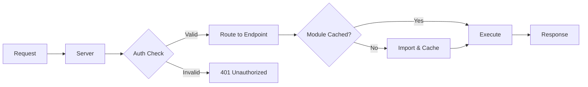

<div align="center">

# NanoWarp

### Lightning-Fast API Framework with Hot-Swappable File-Based Endpoints

[](https://www.npmjs.com/package/nanowarp)
[](https://opensource.org/licenses/MIT)
[](https://www.typescriptlang.org/)
[](https://bun.sh)
[](https://nodejs.org)

**[Quick Start](#-quick-start)** •
**[Documentation](#-documentation)** •
**[Examples](#-examples)** •
**[Contributing](#-contributing)**

</div>

## 🚀 Overview

**NanoWarp** is a modern, high-performance API framework that eliminates the complexity of traditional backend development. Built with cross-runtime compatibility for both **Bun** and **Node.js**, it offers instant hot-reload, file-based routing, and production-grade reliability—all in a lightweight, dependency-minimal package.

### Core Philosophy

Drop a `.ts` file in a folder → instant API endpoint. Edit it → changes apply immediately.
**No restart. No rebuild. No configuration.**

```typescript
// data/Endpoints/GET/hello.ts
export const execute = async (path, request, Database) => {
    return new Response('Hello World!');
};
```

Access your endpoint: `http://localhost:3000/hello` ✨

---

## ✨ Key Features

### Developer Experience
- **⚡ Hot Reload** - File watcher detects changes and reloads endpoints instantly
- **📁 File-Based Routing** - File location maps directly to API paths
- **🎯 Zero Configuration** - No config files, no build steps, just code
- **📦 Minimal Dependencies** - Lightweight footprint for fast installs and deploys
- **🔄 Cross-Runtime** - Works seamlessly on both Bun and Node.js

### Production Ready
- **🛡️ Error Boundaries** - Endpoint crashes don't kill the server
- **⏱️ Request Timeouts** - 30-second automatic timeout prevents infinite loops
- **🔐 API Key Authentication** - Built-in auth with expiration and path whitelisting
- **📊 Rate Limiting** - Token bucket algorithm prevents abuse
- **🔒 Atomic Operations** - File-level locks prevent data corruption
- **🧹 Graceful Shutdown** - Waits for in-flight requests before stopping

### Data Management
- **💾 Pluggable Backends** - Filesystem (default) or SQLite as a drop-in — zero endpoint code changes
- **⚛️ Atomic Writes** - Temp file + atomic rename (filesystem) or `INSERT OR REPLACE` + WAL (SQLite)
- **🔐 Mutex Locks** - Per-file write queues prevent concurrent write issues
- **📂 Directory Indexing** - Fast lookups with cached directory structure

---

## 📦 Installation

```bash
# Using npm
npm install nanowarp

# Using Bun
bun add nanowarp

# Using pnpm
pnpm add nanowarp

# Using yarn
yarn add nanowarp
```

**Requirements:**
- **Node.js** 18+ or **Bun** 1.0+
- **TypeScript** 5.0+ (recommended)

---

## 🚀 Quick Start

### Fastest path: scaffold a project

```bash
bunx nanowarp-init my-api
cd my-api
bun install
bun run dev
```

This creates a complete project (server.ts, data/Endpoints/{GET,POST,PUT,PATCH,DELETE}/, sample health endpoint, docker-compose.yml, .gitignore, package.json with nanowarp listed). Visit http://localhost:3000/health to confirm it's running, http://localhost:3000/docs for Swagger UI.

### Or assemble it manually

### 1. Create Your Server

```typescript
import { NanoWarp } from 'nanowarp';

// Default configuration (port 3000, ./data directory)
const server = new NanoWarp();
await server.start();

console.log('🚀 Server running on http://localhost:3000');
```

**Run with Bun (recommended):**
```bash
bun server.ts
```

**Run with Node.js:**
```bash
npx tsx server.ts
# or after building: node dist/server.js
```

### 2. Create Your First Endpoint

```bash
mkdir -p data/Endpoints/GET
```

Create `data/Endpoints/GET/hello.ts`:

```typescript
export const execute = async (path: string, request: Request, Database: any) => {
    return new Response('Hello from NanoWarp! 👋', {
        status: 200,
        headers: { 'Content-Type': 'text/plain' },
    });
};
```

### 3. Test Your Endpoint

```bash
curl http://localhost:3000/hello
# Output: Hello from NanoWarp! 👋
```

### Custom Configuration

```typescript
import { NanoWarp } from 'nanowarp';

// Custom port and data directory
const server = new NanoWarp(8080, './my-data');
await server.start();
```

---

## 🐳 Docker

NanoWarp ships a published Docker image so you can run it without installing Bun or Node locally. Drop your endpoint files into a host directory, mount it at `/data`, and you have a running API.

The image is built `FROM oven/bun:1-alpine` and runs `bun run docker/entrypoint.ts` — Bun executes the endpoint `.ts` files directly with no transpile step. When `DB_BACKEND=sqlite`, the container uses Bun's built-in `bun:sqlite` (no extra dependencies).

### Quick run

```bash
mkdir -p data/Endpoints/GET
cat > data/Endpoints/GET/health.ts <<'EOF'
export const execute = async () =>
  new Response(JSON.stringify({ ok: true }), {
    headers: { 'Content-Type': 'application/json' },
  });
EOF

docker run --rm \
  -p 3000:3000 \
  -v "$(pwd)/data:/data" \
  ncwardell/nanowarp:latest

# In another terminal:
curl http://localhost:3000/health
# {"ok":true}
```

### Docker Compose

A `docker-compose.yml` is included at the repo root. Minimal form:

```yaml
services:
  nanowarp:
    image: ncwardell/nanowarp:latest
    ports:
      - "3000:3000"
    volumes:
      - ./data:/data
    environment:
      DB_BACKEND: filesystem
      OPENAPI_ENABLED: "true"
    restart: unless-stopped
```

Then `docker compose up`.

### Endpoint dependencies

If your endpoints `import` packages from npm (e.g. `csv-parse`, `zod`, `lodash`), the container handles them automatically:

1. **You mounted a pre-built `/data/node_modules`** → used as-is, no install (fast)
2. **`/data/package.json` exists, no `node_modules`** → container runs `bun install` in `/data` on startup (Option C)
3. **Neither exists** → container creates an empty `/data/node_modules`

After any of the above, the bundled framework is symlinked into `/data/node_modules/nanowarp` (only if you didn't install your own copy), so endpoints can always `import { DataManager, setColor } from 'nanowarp'`.

```
data/
├── package.json          # optional — list npm deps your endpoints need
├── node_modules/         # auto-managed (install or pre-built)
│   ├── csv-parse/        # ← from your package.json
│   └── nanowarp -> /app  # ← framework symlink (auto-created)
└── Endpoints/
    └── POST/
        └── parse.ts      # `import { parse } from 'csv-parse'` works
```

**Example user `data/package.json`:**

```json
{
  "name": "my-api",
  "type": "module",
  "dependencies": {
    "csv-parse": "^5.5.6",
    "zod": "^3.22.0"
  }
}
```

You can pin a specific `nanowarp` version by adding it to your dependencies — the user-installed copy wins over the framework symlink. To skip auto-install entirely, set `INSTALL_ON_START=false` (e.g. for read-only filesystems).

### Volume layout (`/data`)

```
data/
├── Endpoints/             # Your endpoint .ts files (required — bun imports these at runtime)
│   ├── GET/
│   ├── POST/
│   ├── PUT/
│   ├── PATCH/
│   └── DELETE/
├── apikeys.json           # Optional: API auth config
├── data.db                # Auto-created when DB_BACKEND=sqlite
└── *.json                 # Your data files (filesystem backend)
```

### Configuration via environment variables

Every NanoWarp config knob is available as an env var, so the same image runs anywhere with no code changes.

| Variable | Default | Description |
|---|---|---|
| `PORT` | `3000` | HTTP port to bind inside the container |
| `DATA_PATH` | `/data` | Path holding `Endpoints/` and user data |
| `DB_BACKEND` | `filesystem` | Backend for endpoint data ops: `filesystem` or `sqlite`. Endpoint code is identical for either |
| `SQLITE_PATH` | `${DATA_PATH}/data.db` | SQLite file location (only used when `DB_BACKEND=sqlite`) |
| `INSTALL_ON_START` | `true` | If `/data/package.json` exists and there's no `node_modules`, run `bun install` on startup. Set `false` to skip |
| `LOGGING` | `true` | Request logging on/off |
| `OPENAPI_ENABLED` | `false` | Serve `/openapi.json` and Swagger UI |
| `OPENAPI_UI_PATH` | `/docs` | Where Swagger UI is mounted |
| `OPENAPI_SPEC_PATH` | `/openapi.json` | Where the OpenAPI JSON spec is served |
| `OPENAPI_TITLE` | `NanoWarp API` | API title shown in Swagger |
| `OPENAPI_VERSION` | `1.0.0` | API version shown in Swagger |
| `OPENAPI_DESCRIPTION` | _(unset)_ | API description shown in Swagger |
| `API_KEY_TTL` | `60000` | API-key cache TTL in ms |
| `MODULE_CACHE_SIZE` | `100` | Max endpoint modules in the LRU cache |
| `REQUEST_TIMEOUT` | `30000` | Per-request timeout in ms |
| `SHUTDOWN_TIMEOUT` | `30000` | Graceful-shutdown grace period in ms |

### Switching to the SQLite backend

The container exposes the same backend toggle as the library. Endpoint code is unchanged either way:

```bash
docker run --rm -p 3000:3000 \
  -v "$(pwd)/data:/data" \
  -e DB_BACKEND=sqlite \
  ncwardell/nanowarp:latest
```

User data goes through SQLite (writes are atomic via `INSERT OR REPLACE`, WAL mode enabled). The `Endpoints/` directory still lives on the mounted volume — only user data moves to SQLite.

### Building from source

```bash
git clone https://github.com/ncwardell/NanoWarp.git
cd NanoWarp
docker build -t nanowarp:local .
docker run --rm -p 3000:3000 -v "$(pwd)/examples/Database:/data" nanowarp:local
```

### Image tags

Multi-arch images (`linux/amd64` + `linux/arm64`) are published on every GitHub Release:

- `latest` — most recent release
- `1.2.3` — specific patch
- `1.2` — latest patch within a minor
- `1` — latest within a major

### Healthcheck

The image does not include a default healthcheck — endpoint paths vary per project. Add one in compose if you want, e.g.:

```yaml
healthcheck:
  test: ["CMD", "wget", "--spider", "-q", "http://localhost:3000/health"]
  interval: 30s
  timeout: 3s
  start_period: 5s
  retries: 3
```

(Requires a `/health` endpoint in your `Endpoints/GET/` directory.)

---

## 📖 Documentation

### File-Based Routing

File paths automatically map to URL endpoints based on HTTP method and location:

```
data/Endpoints/
├── GET/
│   ├── users.ts              → GET /users
│   ├── users/
│   │   └── profile.ts        → GET /users/profile
│   └── health.ts             → GET /health
└── POST/
    ├── users.ts              → POST /users
    └── auth/
        └── login.ts          → POST /auth/login
```

### Endpoint Structure

Every endpoint must export an `execute` function. Optionally, you can export `rateLimit` and `schema` configurations:

```typescript
// Required: Execute function
export const execute = async (
    path: string,        // The request path (e.g., "users/profile")
    request: Request,    // Web Standards Request object
    Database: DataManager // NanoWarp database manager instance
): Promise<Response> => {
    // Your endpoint logic here
    return new Response('Success', {
        status: 200,
        headers: { 'Content-Type': 'text/plain' }
    });
};

// Optional: Rate limiting configuration (disabled by default)
export const rateLimit = {
    enabled: true,
    maxTokens: 100,
    refillRate: 10,
    refillInterval: 1000,
};

// Optional: OpenAPI schema (auto-generated defaults if not provided)
export const schema = {
    summary: 'Endpoint description',
    description: 'Detailed endpoint documentation',
    tags: ['API'],
    // ... other OpenAPI schema properties
};
```

### Working with Data

NanoWarp provides a simple yet powerful data API:

```typescript
// Read data
const data = await Database.retrieveData('./data/users.json');

// Write data (atomic + locked for safety)
await Database.saveData('./data/users.json', JSON.stringify(data));

// Delete data
await Database.deleteData('./data/users.json');
```

**Smart Data Handling:**
- `.json` and `.lock` paths → Parsed JSON object
- Directory-style paths → Array of immediate child names
- Any other path → ArrayBuffer (binary data)
- Missing path → `false`

### Database Backends

The three data ops above are backed by a pluggable `DataStore`. Endpoint code is identical regardless of which backend is selected — switching backends is a one-line config change.

| Backend | Default? | Storage | Runtime requirement |
|---|---|---|---|
| `filesystem` | ✅ | One file on disk per `saveData` call | None |
| `sqlite` | | One SQLite database file with a single `kv` table | Bun (built-in) or Node 22.5+ (built-in) |
| `postgres` | | One Postgres table (default `nanowarp_kv`) | `pg` package installed (`bun add pg`) |

```typescript
import { NanoWarp } from 'nanowarp';

// Default — filesystem backend
const a = new NanoWarp({ port: 3000 });

// SQLite backend (drop-in: zero endpoint code changes)
const b = new NanoWarp({
    port: 3000,
    database: {
        backend: 'sqlite',
        sqlite: { path: './data/data.db' }, // optional; defaults to ${dataPath}/data.db
    },
});

// Postgres backend (clients with an existing Postgres can plug in directly)
const c = new NanoWarp({
    port: 3000,
    database: {
        backend: 'postgres',
        postgres: {
            connectionString: process.env.DATABASE_URL!,
            tableName: 'nanowarp_kv', // optional; defaults to 'nanowarp_kv'
        },
    },
});
```

**Runtime requirements:**
- **SQLite, Bun**: built-in via `bun:sqlite` (no extra deps)
- **SQLite, Node**: requires Node **22.5+** for `node:sqlite` (no extra deps)
- **Postgres**: install `pg` (`bun add pg` or `npm install pg`)

**What stays on disk regardless of backend:**
- The `Endpoints/` directory itself — the framework imports endpoint `.ts` files at runtime
- `database.lock` — framework metadata (the cached endpoint directory tree)

Only *user data* moves into SQLite; framework infrastructure is always on the filesystem.

**Custom backends:** the `DataStore` interface is exported, so you can implement your own (Redis, Postgres, S3, etc.) and pass it via the `DataManager` constructor. Endpoint code still doesn't change.

### Migrating Between Backends

Switching backends after you have data already? Use the bundled migration tool. It enumerates every leaf in the source store, reads the value, and writes it to the target. Framework metadata (`database.lock`, the `Endpoints/` tree, the SQLite database file itself) is skipped automatically — only user data moves.

**CLI:**

```bash
# Filesystem → SQLite (one DB file containing all your JSON)
bunx nanowarp-migrate --data-path ./data --from filesystem --to sqlite

# SQLite → Filesystem (export back to inspectable, git-diffable files)
bunx nanowarp-migrate --data-path ./data --from sqlite --to filesystem

# Preview without writing
bunx nanowarp-migrate --data-path ./data --from filesystem --to sqlite --dry-run
```

When developing locally you can also run it via Bun directly: `bun run migrate -- --data-path ./data --from filesystem --to sqlite`.

**Programmatic:**

```typescript
import { migrate, FilesystemStore, SqliteStore } from 'nanowarp';

const from = new FilesystemStore();
const to = new SqliteStore('./data/data.db');
await to.initialize();

const result = await migrate({
    from,
    to,
    prefix: './data',
    onProgress: ({ path, index }) => console.log(`  [${index}] ${path}`),
});

console.log(`migrated=${result.migrated} skipped=${result.skipped} failed=${result.failed}`);
```

**Migration is non-destructive** — source data is left in place. After verifying the target works, switch your `database.backend` config and delete or archive the source data manually.

---

## 💡 Examples

### Complete REST API: Todo Application

#### GET Endpoint - List Todos

`data/Endpoints/GET/todos.ts`:

```typescript
// Only the execute function is required
export const execute = async (path, request, Database) => {
    try {
        const todos = await Database.retrieveData('./data/todos.json') || [];

        return new Response(JSON.stringify(todos), {
            status: 200,
            headers: { 'Content-Type': 'application/json' }
        });
    } catch (error) {
        return new Response(JSON.stringify({ error: 'Failed to retrieve todos' }), {
            status: 500,
            headers: { 'Content-Type': 'application/json' }
        });
    }
};
```

#### POST Endpoint - Create Todo

`data/Endpoints/POST/todos.ts`:

```typescript
export const execute = async (path, request, Database) => {
    try {
        const body = await request.json();

        // Validate input
        if (!body.title) {
            return new Response(JSON.stringify({ error: 'Title is required' }), {
                status: 400,
                headers: { 'Content-Type': 'application/json' }
            });
        }

        // Retrieve existing todos
        const todos = await Database.retrieveData('./data/todos.json') || [];

        // Create new todo
        const newTodo = {
            id: Date.now(),
            title: body.title,
            completed: false,
            createdAt: new Date().toISOString()
        };

        todos.push(newTodo);

        // Save atomically
        await Database.saveData('./data/todos.json', JSON.stringify(todos, null, 2));

        return new Response(JSON.stringify(newTodo), {
            status: 201,
            headers: { 'Content-Type': 'application/json' }
        });
    } catch (error) {
        return new Response(JSON.stringify({ error: 'Failed to create todo' }), {
            status: 500,
            headers: { 'Content-Type': 'application/json' }
        });
    }
};
```

**Test Your API:**

```bash
# Create a todo
curl -X POST http://localhost:3000/todos \
  -H "Content-Type: application/json" \
  -d '{"title":"Build awesome API"}'

# List all todos
curl http://localhost:3000/todos
```

### Query Parameters and URL Parsing

`data/Endpoints/GET/users/search.ts`:

```typescript
export const execute = async (path, request, Database) => {
    const url = new URL(request.url);
    const name = url.searchParams.get('name');
    const limit = parseInt(url.searchParams.get('limit') || '10');

    // Fetch and filter users
    const allUsers = await Database.retrieveData('./data/users.json') || [];
    const filtered = name
        ? allUsers.filter(u => u.name.includes(name))
        : allUsers;

    return new Response(JSON.stringify(filtered.slice(0, limit)), {
        headers: { 'Content-Type': 'application/json' }
    });
};
```

```bash
# Test with query parameters
curl "http://localhost:3000/users/search?name=John&limit=5"
```

---

## 🔐 Security

### API Key Authentication

Create `data/apikeys.json`:

```json
{
  "keys": {
    "prod-key-abc123": "2025-12-31T23:59:59.000Z",
    "dev-key-xyz789": "2024-06-30T23:59:59.000Z"
  },
  "whitelist": ["/health", "/public"]
}
```

**Features:**
- ⏱️ **Automatic Expiration** - Keys expire based on ISO date
- 🎯 **Path Whitelisting** - Public endpoints bypass authentication
- 💾 **60-Second Cache** - Reduces file I/O overhead
- 🔓 **Optional Auth** - No keys file = no authentication required

**Usage:**

```bash
# Authenticated request
curl -H "X-API-Key: prod-key-abc123" http://localhost:3000/users

# Whitelisted path (no key required)
curl http://localhost:3000/health
```

### JWT Bearer Authentication

For consulting-style auth where an upstream IDP mints HS256 tokens, drop in the bundled `jwt` middleware:

```typescript
import { NanoWarp, jwt, getJwtPayload } from 'nanowarp';

const server = new NanoWarp({
    port: 3000,
    middleware: {
        before: [jwt({
            secret: process.env.JWT_SECRET!,
            paths: ['/admin'],          // optional: only paths starting with /admin require auth
            exclude: ['/health'],       // optional: bypass these even if matched
            clockSkew: 30,              // optional: tolerance in seconds for `exp`
        })],
    },
});
```

Inside any endpoint, read the decoded payload:

```typescript
// data/Endpoints/GET/admin/me.ts
import { getJwtPayload } from 'nanowarp';

export const execute = async (path, request) => {
    const claims = getJwtPayload(request);
    // claims is the decoded JWT payload (sub, exp, custom claims, etc.) or null
    return new Response(JSON.stringify(claims), {
        headers: { 'Content-Type': 'application/json' },
    });
};
```

**Properties:**
- HS256 only (most common for symmetric-secret consulting auth)
- `none` algorithm rejected unconditionally
- `exp` and `nbf` claims enforced
- No third-party dependency — implemented with Web Crypto
- For RS256 / ES256 / JWKS rotation, drop in `jose` instead (a 12-line custom middleware)

### Rate Limiting

Built-in token bucket algorithm protects against abuse:

- **Disabled by default** - Enable per endpoint as needed
- **Per-endpoint configuration** - Different limits for different endpoints
- **100 tokens per IP** (configurable)
- **Refills at 10 tokens/second** (configurable)
- **Automatic cleanup** of inactive IPs
- **429 Too Many Requests** response when limit exceeded

Enable rate limiting by exporting a `rateLimit` configuration in your endpoint:

```typescript
export const rateLimit = {
    enabled: true,
    maxTokens: 100,
    refillRate: 10,
    refillInterval: 1000,
};
```

---

## ⚡ Performance & Reliability

### Production Features

| Feature | Description |
|---------|-------------|
| **Error Boundaries** | Endpoint crashes are isolated—server stays healthy |
| **30s Timeout** | Automatic termination of long-running requests |
| **Atomic Writes** | Temp file + atomic rename prevents data corruption |
| **File Locks** | Mutex-based locking prevents concurrent write issues |
| **Graceful Shutdown** | Waits for in-flight requests before stopping |
| **Hot Reload** | File watcher detects changes, reloads instantly |
| **LRU Cache** | Smart module caching with auto-eviction (100 entry limit) |
| **Cross-Runtime** | Zero-overhead abstraction for Bun and Node.js |

### How It Works



**Technical Implementation:**

1. **Module Caching** - Endpoints cached until file changes detected
2. **File Watching** - `fs.watch()` monitors endpoint files for changes
3. **Version Busting** - `import(path?v=N)` forces fresh imports after edits
4. **Atomic Writes** - Write to `.tmp` → `fs.rename()` (POSIX guarantees atomicity)
5. **Mutex Locks** - Per-file write queue prevents race conditions
6. **LRU Eviction** - Least-recently-used modules evicted when cache reaches 100 entries

---

## 📁 Project Structure

```
your-project/
├── data/                       # Data directory (customizable)
│   ├── apikeys.json           # Optional: API authentication config
│   ├── database.lock          # Auto-generated: directory structure cache
│   ├── Endpoints/             # Your API endpoints
│   │   ├── GET/
│   │   │   ├── users.ts       # GET /users
│   │   │   ├── users/
│   │   │   │   └── profile.ts # GET /users/profile
│   │   │   └── health.ts      # GET /health
│   │   └── POST/
│   │       ├── users.ts       # POST /users
│   │       └── auth/
│   │           └── login.ts   # POST /auth/login
│   ├── users.json             # Your data (any structure)
│   └── todos.json             # More data
├── server.ts                   # Your server entry point
└── package.json
```

---

## 🎯 Use Cases

### ✅ Perfect For

| Use Case | Why NanoWarp Excels |
|----------|---------------------|
| **Rapid Prototyping** | Zero configuration, instant endpoints |
| **Microservices** | Fast startup, minimal footprint (~5MB) |
| **Webhooks** | Hot-swap logic without downtime |
| **Edge Computing** | Minimal dependencies, cross-runtime |
| **Version Control** | Endpoints are files—easy git workflows |
| **Internal Tools** | Simple APIs for dashboards and automation |
| **Learning Projects** | No database complexity, focus on logic |

### ⚠️ Not Recommended For

| Scenario | Better Alternative |
|----------|-------------------|
| High-concurrency writes to same file | PostgreSQL, MySQL, MongoDB |
| Complex relational queries | SQLite, PostgreSQL |
| Multi-TB datasets | Traditional DBMS with indexing |
| Netflix-scale traffic | Distributed DB + CDN + caching layer |

---

## 🏗️ Architecture

### Core Components

```
┌─────────────────────────────────────────┐
│           NanoWarp Server               │
├─────────────────────────────────────────┤
│  ┌─────────────┐    ┌──────────────┐  │
│  │   Server    │────│ Rate Limiter │  │
│  │  (HTTP)     │    │ (Token Bucket)│  │
│  └──────┬──────┘    └──────────────┘  │
│         │                               │
│  ┌──────▼──────┐    ┌──────────────┐  │
│  │ Auth Layer  │────│  API Keys    │  │
│  │  (Optional) │    │   Cache      │  │
│  └──────┬──────┘    └──────────────┘  │
│         │                               │
│  ┌──────▼──────┐    ┌──────────────┐  │
│  │   Router    │────│Module Cache  │  │
│  │ (File-Based)│    │   (LRU)      │  │
│  └──────┬──────┘    └──────────────┘  │
│         │                               │
│  ┌──────▼──────┐    ┌──────────────┐  │
│  │  Endpoint   │────│File Watcher  │  │
│  │  Executor   │    │(Hot Reload)  │  │
│  └──────┬──────┘    └──────────────┘  │
│         │                               │
│  ┌──────▼──────┐                       │
│  │  Database   │                       │
│  │  Manager    │                       │
│  │ (File-Based)│                       │
│  └─────────────┘                       │
└─────────────────────────────────────────┘
```

---

## 🤝 Contributing

We welcome contributions! Here's how you can help:

### Development Setup

```bash
# Clone the repository
git clone https://github.com/ncwardell/NanoWarp.git
cd NanoWarp

# Install dependencies
bun install

# Run tests
bun test

# Build the project
bun run build
```

### Contributing Guidelines

1. **Fork** the repository
2. **Create** a feature branch (`git checkout -b feature/amazing-feature`)
3. **Commit** your changes (`git commit -m 'Add amazing feature'`)
4. **Push** to the branch (`git push origin feature/amazing-feature`)
5. **Open** a Pull Request

Please ensure:
- ✅ Code follows existing style conventions
- ✅ All tests pass
- ✅ New features include tests
- ✅ Documentation is updated

---

## 📄 License

This project is licensed under the **MIT License** - see the [LICENSE](LICENSE) file for details.

---

## 🙏 Acknowledgments

- Built with [Bun](https://bun.sh) and [Node.js](https://nodejs.org)
- Inspired by modern file-based frameworks
- Community feedback and contributions

---

## 📞 Support

- **Issues**: [GitHub Issues](https://github.com/ncwardell/NanoWarp/issues)
- **Discussions**: [GitHub Discussions](https://github.com/ncwardell/NanoWarp/discussions)
- **Documentation**: [Full Documentation](https://github.com/ncwardell/NanoWarp#readme)

---

<div align="center">

**[⬆ Back to Top](#nanowarp)**

Made with ❤️ by the NanoWarp team

</div>
