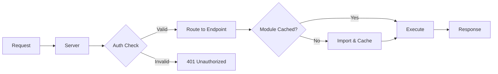

<div align="center">

# NanoWarp

### Lightning-Fast API Framework with Hot-Swappable File-Based Endpoints

[](https://www.npmjs.com/package/nanowarp)
[](https://opensource.org/licenses/MIT)
[](https://www.typescriptlang.org/)
[](https://bun.sh)
[](https://nodejs.org)

**[Quick Start](#-quick-start)** •
**[Documentation](#-documentation)** •
**[Examples](#-examples)** •
**[Contributing](#-contributing)**

</div>

## 🚀 Overview

**NanoWarp** is a modern, high-performance API framework that eliminates the complexity of traditional backend development. Built with cross-runtime compatibility for both **Bun** and **Node.js**, it offers instant hot-reload, file-based routing, and production-grade reliability—all in a lightweight, dependency-minimal package.

### Core Philosophy

Drop a `.ts` file in a folder → instant API endpoint. Edit it → changes apply immediately.
**No restart. No rebuild. No configuration.**

```typescript
// data/Endpoints/GET/hello.ts
export const execute = async (path, request, Database) => {
    return new Response('Hello World!');
};
```

Access your endpoint: `http://localhost:3000/hello` ✨

---

## ✨ Key Features

### Developer Experience
- **⚡ Hot Reload** - File watcher detects changes and reloads endpoints instantly
- **📁 File-Based Routing** - File location maps directly to API paths
- **🎯 Zero Configuration** - No config files, no build steps, just code
- **📦 Minimal Dependencies** - Lightweight footprint for fast installs and deploys
- **🔄 Cross-Runtime** - Works seamlessly on both Bun and Node.js

### Production Ready
- **🛡️ Error Boundaries** - Endpoint crashes don't kill the server
- **⏱️ Request Timeouts** - 30-second automatic timeout prevents infinite loops
- **🔐 API Key Authentication** - Built-in auth with expiration and path whitelisting
- **📊 Rate Limiting** - Token bucket algorithm prevents abuse
- **🔒 Atomic Operations** - File-level locks prevent data corruption
- **🧹 Graceful Shutdown** - Waits for in-flight requests before stopping

### Data Management
- **💾 File-Based Database** - Your filesystem IS the database
- **⚛️ Atomic Writes** - Temp file + atomic rename ensures data integrity
- **🔐 Mutex Locks** - Per-file write queues prevent concurrent write issues
- **📂 Directory Indexing** - Fast lookups with cached directory structure

---

## 📦 Installation

```bash
# Using npm
npm install nanowarp

# Using Bun
bun add nanowarp

# Using pnpm
pnpm add nanowarp

# Using yarn
yarn add nanowarp
```

**Requirements:**
- **Node.js** 18+ or **Bun** 1.0+
- **TypeScript** 5.0+ (recommended)

---

## 🚀 Quick Start

### 1. Create Your Server

```typescript
import { NanoWarp } from 'nanowarp';

// Default configuration (port 3000, ./data directory)
const server = new NanoWarp();
await server.start();

console.log('🚀 Server running on http://localhost:3000');
```

### 2. Create Your First Endpoint

```bash
mkdir -p data/Endpoints/GET
```

Create `data/Endpoints/GET/hello.ts`:

```typescript
export const execute = async (path: string, request: Request, Database: any) => {
    return new Response('Hello from NanoWarp! 👋', {
        status: 200,
        headers: { 'Content-Type': 'text/plain' },
    });
};
```

### 3. Test Your Endpoint

```bash
curl http://localhost:3000/hello
# Output: Hello from NanoWarp! 👋
```

### Custom Configuration

```typescript
import { NanoWarp } from 'nanowarp';

// Custom port and data directory
const server = new NanoWarp(8080, './my-data');
await server.start();
```

---

## 📖 Documentation

### File-Based Routing

File paths automatically map to URL endpoints based on HTTP method and location:

```
data/Endpoints/
├── GET/
│   ├── users.ts              → GET /users
│   ├── users/
│   │   └── profile.ts        → GET /users/profile
│   └── health.ts             → GET /health
└── POST/
    ├── users.ts              → POST /users
    └── auth/
        └── login.ts          → POST /auth/login
```

### Endpoint Structure

Every endpoint must export an `execute` function with the following signature:

```typescript
export const execute = async (
    path: string,        // The request path (e.g., "users/profile")
    request: Request,    // Web Standards Request object
    Database: DataManager // NanoWarp database manager instance
): Promise<Response> => {
    // Your endpoint logic here
    return new Response('Success', {
        status: 200,
        headers: { 'Content-Type': 'text/plain' }
    });
};
```

### Working with Data

NanoWarp provides a simple yet powerful file-based data API:

```typescript
// Read data
const data = await Database.retrieveData('./data/users.json');

// Write data (atomic + locked for safety)
await Database.saveData('./data/users.json', JSON.stringify(data));

// Delete data
await Database.deleteData('./data/users.json');
```

**Smart Data Handling:**
- `.json` and `.lock` files → Parsed JSON object
- Directories → Array of filenames
- Other files → ArrayBuffer (binary data)

---

## 💡 Examples

### Complete REST API: Todo Application

#### GET Endpoint - List Todos

`data/Endpoints/GET/todos.ts`:

```typescript
export const execute = async (path, request, Database) => {
    try {
        const todos = await Database.retrieveData('./data/todos.json') || [];

        return new Response(JSON.stringify(todos), {
            status: 200,
            headers: { 'Content-Type': 'application/json' }
        });
    } catch (error) {
        return new Response(JSON.stringify({ error: 'Failed to retrieve todos' }), {
            status: 500,
            headers: { 'Content-Type': 'application/json' }
        });
    }
};
```

#### POST Endpoint - Create Todo

`data/Endpoints/POST/todos.ts`:

```typescript
export const execute = async (path, request, Database) => {
    try {
        const body = await request.json();

        // Validate input
        if (!body.title) {
            return new Response(JSON.stringify({ error: 'Title is required' }), {
                status: 400,
                headers: { 'Content-Type': 'application/json' }
            });
        }

        // Retrieve existing todos
        const todos = await Database.retrieveData('./data/todos.json') || [];

        // Create new todo
        const newTodo = {
            id: Date.now(),
            title: body.title,
            completed: false,
            createdAt: new Date().toISOString()
        };

        todos.push(newTodo);

        // Save atomically
        await Database.saveData('./data/todos.json', JSON.stringify(todos, null, 2));

        return new Response(JSON.stringify(newTodo), {
            status: 201,
            headers: { 'Content-Type': 'application/json' }
        });
    } catch (error) {
        return new Response(JSON.stringify({ error: 'Failed to create todo' }), {
            status: 500,
            headers: { 'Content-Type': 'application/json' }
        });
    }
};
```

**Test Your API:**

```bash
# Create a todo
curl -X POST http://localhost:3000/todos \
  -H "Content-Type: application/json" \
  -d '{"title":"Build awesome API"}'

# List all todos
curl http://localhost:3000/todos
```

### Query Parameters and URL Parsing

`data/Endpoints/GET/users/search.ts`:

```typescript
export const execute = async (path, request, Database) => {
    const url = new URL(request.url);
    const name = url.searchParams.get('name');
    const limit = parseInt(url.searchParams.get('limit') || '10');

    // Fetch and filter users
    const allUsers = await Database.retrieveData('./data/users.json') || [];
    const filtered = name
        ? allUsers.filter(u => u.name.includes(name))
        : allUsers;

    return new Response(JSON.stringify(filtered.slice(0, limit)), {
        headers: { 'Content-Type': 'application/json' }
    });
};
```

```bash
# Test with query parameters
curl "http://localhost:3000/users/search?name=John&limit=5"
```

---

## 🔐 Security

### API Key Authentication

Create `data/apikeys.json`:

```json
{
  "keys": {
    "prod-key-abc123": "2025-12-31T23:59:59.000Z",
    "dev-key-xyz789": "2024-06-30T23:59:59.000Z"
  },
  "whitelist": ["/health", "/public"]
}
```

**Features:**
- ⏱️ **Automatic Expiration** - Keys expire based on ISO date
- 🎯 **Path Whitelisting** - Public endpoints bypass authentication
- 💾 **60-Second Cache** - Reduces file I/O overhead
- 🔓 **Optional Auth** - No keys file = no authentication required

**Usage:**

```bash
# Authenticated request
curl -H "X-API-Key: prod-key-abc123" http://localhost:3000/users

# Whitelisted path (no key required)
curl http://localhost:3000/health
```

### Rate Limiting

Built-in token bucket algorithm protects against abuse:

- **100 tokens per IP** (configurable)
- **Refills at 10 tokens/second**
- **Automatic cleanup** of inactive IPs
- **429 Too Many Requests** response when limit exceeded

---

## ⚡ Performance & Reliability

### Production Features

| Feature | Description |
|---------|-------------|
| **Error Boundaries** | Endpoint crashes are isolated—server stays healthy |
| **30s Timeout** | Automatic termination of long-running requests |
| **Atomic Writes** | Temp file + atomic rename prevents data corruption |
| **File Locks** | Mutex-based locking prevents concurrent write issues |
| **Graceful Shutdown** | Waits for in-flight requests before stopping |
| **Hot Reload** | File watcher detects changes, reloads instantly |
| **LRU Cache** | Smart module caching with auto-eviction (100 entry limit) |
| **Cross-Runtime** | Zero-overhead abstraction for Bun and Node.js |

### How It Works



**Technical Implementation:**

1. **Module Caching** - Endpoints cached until file changes detected
2. **File Watching** - `fs.watch()` monitors endpoint files for changes
3. **Version Busting** - `import(path?v=N)` forces fresh imports after edits
4. **Atomic Writes** - Write to `.tmp` → `fs.rename()` (POSIX guarantees atomicity)
5. **Mutex Locks** - Per-file write queue prevents race conditions
6. **LRU Eviction** - Least-recently-used modules evicted when cache reaches 100 entries

---

## 📁 Project Structure

```
your-project/
├── data/                       # Data directory (customizable)
│   ├── apikeys.json           # Optional: API authentication config
│   ├── database.lock          # Auto-generated: directory structure cache
│   ├── Endpoints/             # Your API endpoints
│   │   ├── GET/
│   │   │   ├── users.ts       # GET /users
│   │   │   ├── users/
│   │   │   │   └── profile.ts # GET /users/profile
│   │   │   └── health.ts      # GET /health
│   │   └── POST/
│   │       ├── users.ts       # POST /users
│   │       └── auth/
│   │           └── login.ts   # POST /auth/login
│   ├── users.json             # Your data (any structure)
│   └── todos.json             # More data
├── server.ts                   # Your server entry point
└── package.json
```

---

## 🎯 Use Cases

### ✅ Perfect For

| Use Case | Why NanoWarp Excels |
|----------|---------------------|
| **Rapid Prototyping** | Zero configuration, instant endpoints |
| **Microservices** | Fast startup, minimal footprint (~5MB) |
| **Webhooks** | Hot-swap logic without downtime |
| **Edge Computing** | Minimal dependencies, cross-runtime |
| **Version Control** | Endpoints are files—easy git workflows |
| **Internal Tools** | Simple APIs for dashboards and automation |
| **Learning Projects** | No database complexity, focus on logic |

### ⚠️ Not Recommended For

| Scenario | Better Alternative |
|----------|-------------------|
| High-concurrency writes to same file | PostgreSQL, MySQL, MongoDB |
| Complex relational queries | SQLite, PostgreSQL |
| Multi-TB datasets | Traditional DBMS with indexing |
| Netflix-scale traffic | Distributed DB + CDN + caching layer |

---

## 🏗️ Architecture

### Core Components

```
┌─────────────────────────────────────────┐
│           NanoWarp Server               │
├─────────────────────────────────────────┤
│  ┌─────────────┐    ┌──────────────┐  │
│  │   Server    │────│ Rate Limiter │  │
│  │  (HTTP)     │    │ (Token Bucket)│  │
│  └──────┬──────┘    └──────────────┘  │
│         │                               │
│  ┌──────▼──────┐    ┌──────────────┐  │
│  │ Auth Layer  │────│  API Keys    │  │
│  │  (Optional) │    │   Cache      │  │
│  └──────┬──────┘    └──────────────┘  │
│         │                               │
│  ┌──────▼──────┐    ┌──────────────┐  │
│  │   Router    │────│Module Cache  │  │
│  │ (File-Based)│    │   (LRU)      │  │
│  └──────┬──────┘    └──────────────┘  │
│         │                               │
│  ┌──────▼──────┐    ┌──────────────┐  │
│  │  Endpoint   │────│File Watcher  │  │
│  │  Executor   │    │(Hot Reload)  │  │
│  └──────┬──────┘    └──────────────┘  │
│         │                               │
│  ┌──────▼──────┐                       │
│  │  Database   │                       │
│  │  Manager    │                       │
│  │ (File-Based)│                       │
│  └─────────────┘                       │
└─────────────────────────────────────────┘
```

---

## 🤝 Contributing

We welcome contributions! Here's how you can help:

### Development Setup

```bash
# Clone the repository
git clone https://github.com/ncwardell/NanoWarp.git
cd NanoWarp

# Install dependencies
bun install

# Run tests
bun test

# Build the project
bun run build
```

### Contributing Guidelines

1. **Fork** the repository
2. **Create** a feature branch (`git checkout -b feature/amazing-feature`)
3. **Commit** your changes (`git commit -m 'Add amazing feature'`)
4. **Push** to the branch (`git push origin feature/amazing-feature`)
5. **Open** a Pull Request

Please ensure:
- ✅ Code follows existing style conventions
- ✅ All tests pass
- ✅ New features include tests
- ✅ Documentation is updated

---

## 📄 License

This project is licensed under the **MIT License** - see the [LICENSE](LICENSE) file for details.

---

## 🙏 Acknowledgments

- Built with [Bun](https://bun.sh) and [Node.js](https://nodejs.org)
- Inspired by modern file-based frameworks
- Community feedback and contributions

---

## 📞 Support

- **Issues**: [GitHub Issues](https://github.com/ncwardell/NanoWarp/issues)
- **Discussions**: [GitHub Discussions](https://github.com/ncwardell/NanoWarp/discussions)
- **Documentation**: [Full Documentation](https://github.com/ncwardell/NanoWarp#readme)

---

<div align="center">

**[⬆ Back to Top](#nanowarp)**

Made with ❤️ by the NanoWarp team

</div>
